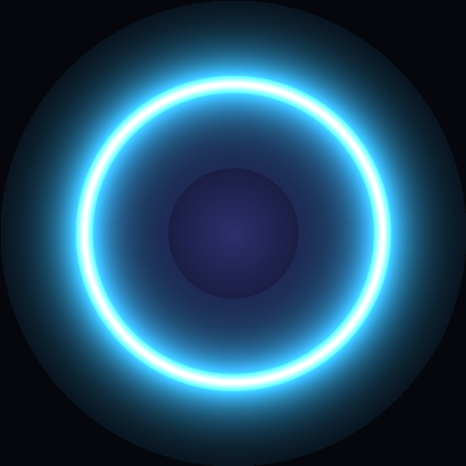

# 〰 STILL

<p align="center">
  
</p>

<h3 align="center">A distraction-free, neuro-acoustic sanctuary for your mind and room.</h3>

<p align="center">
  <em>Zero logins. Zero tracking. Zero ads. Zero algorithms. Just pure, restorative peace.</em>
</p>

<p align="center">
  <a href="https://harixomxsingh.github.io/still/"></a>
  <a href="https://github.com/Harixomxsingh/still/raw/main/Still.apk"></a>
  <a href="https://github.com/Harixomxsingh/still/blob/main/LICENSE"></a>
</p>

---

## 💬 The Origin Story

> *"The modern web is engineered to capture your attention, not to give you stillness."*

Recently, while sitting in my room working on my computer, I realized that calming ambient sound had a profound ability to settle my racing thoughts and transform the entire room's atmosphere. 

Naturally, I’d open YouTube or streaming apps to connect my Bluetooth speaker and put on some ambient music. But the moment I opened the app, I was instantly bombarded by algorithmic feeds, clickbait thumbnails, recommended drama, and ads. Before I knew it, an hour had evaporated—I went in seeking peace, but walked away distracted and overstimulated.

I built **Still** to solve this single problem: to create a **radically simple, distraction-free sanctuary** where calming your nervous system is the only purpose.

— **[Hari Om Singh](https://github.com/Harixomxsingh)**

---

## 🌟 What Makes Still Unique

```
                ┌──────────────────────────────────────────────┐
                │             STILL ECOSYSTEM (v2)             │
                └──────────────────────┬───────────────────────┘
                                       │
        ┌──────────────────────────────┴──────────────────────────────┐
        ▼                                                             ▼
┌───────────────────────────────┐             ┌───────────────────────────────┐
│        🌐 WEB SANCTUARY       │             │       📱 ANDROID NATIVE       │
│  - Procedural Web Audio API   │             │  - True Lock-Screen Playback  │
│  - Instant Keyboard Shortcuts │             │  - Tactile Haptic Vibration   │
│  - Inactivity Auto-Ghost Zen  │             │  - Standalone Offline .APK    │
└───────────────────────────────┘             └───────────────────────────────┘
```

### 1. 🌊 Research-Backed Neuro-Acoustic Frequencies
Still generates live, endless procedural audio directly in your browser or device without loading hefty audio files:

| Soundscape | Core Frequency | Situational Purpose | Neurological Mechanism |
| :--- | :--- | :--- | :--- |
| **Alpha Wave Sanctuary** | `432 Hz Solfeggio` | **Room Tranquility & Stress Relief** | Acoustic resonance that quietens sympathetic fight-or-flight arousal. |
| **Deep Delta Sleep** | `2.5 Hz Delta` | **Deep Sleep & Night Wind-Down** | Sub-bass entrainment targeting slow-wave non-REM physical restoration. |
| **Brownian Rain Shield** | `1/f² Noise + Rain` | **ADHD & Noise Masking** | Acoustic privacy curtain that prevents sudden startle reflex from sudden room noises. |
| **Zen Garden Harmonics** | `528 Hz Transformation`| **0.1 Hz Breathing & HRV Reset** | Modulated Solfeggio chords paired with resonant breathing cycles. |
| **Forest Dusk & Hearth** | `Biophilic 396 Hz` | **Anxiety Relief & Cozy Calm** | Organic nocturnal biophilic frequencies proven to downregulate cortisol. |
| **Cosmic Float & Stillness**| `288 Hz Non-Predictive` | **Overthinking Reset & Mental Rest**| Non-predictive ambient drone chords that stop the brain's predictive parsing loop. |
| **Deep Flow & Study** | `6 Hz Theta Focus` | **Deep Work & Focus Blocks** | Steady isochronic theta brainwave pacing that stops mind-wandering during deep study. |

---

### 2. 🎛️ Live 5-Stem Customizer Engine
Customize every sonic layer to match your current room acoustics and mood:
* **432 Hz Ambient Pads:** Lush Solfeggio analog harmonic swells.
* **1/f² Brownian Noise:** Deep acoustic privacy barrier against sudden room noise.
* **Spatial Rainfall:** Soft, comforting bandpass raindrops.
* **Binaural Brainwaves:** Alpha / Delta frequency entrainment.
* **Eno Piano Drops:** Sporadic, soothing acoustic pentatonic droplets.

---

### 3. 🫁 0.1 Hz Resonant Breathing Pacer
The center pulsing halo guides your breathing to **0.1 Hz (6 breaths per minute)**—the scientifically validated frequency for peak **Heart Rate Variability (HRV)** and vagus nerve stimulation:
* **Inhale (4s):** Expanding outer shockwave halo.
* **Hold (2s):** Concentrated luminous resonance ring.
* **Exhale (4s):** Soft contraction back to the glowing core.
* **Mobile Haptics:** Gentle phone vibration pulses synchronize seamlessly with your breath.

---

### 4. 🎨 4 Curated Mood Palettes
Switch the entire interface, status bar, and glowing halo between 4 tailored color themes:
* 🌙 **Midnight Obsidian (Default):** Deep obsidian `#05070d` with sky cyan `#38bdf8` glow.
* ☀️ **Sunrise Amber:** Warm dawn `#0d0805` with amber gold `#f59e0b` glow.
* 🍃 **Forest Biophilic:** Deep green `#050d08` with emerald `#10b981` accents.
* ✨ **Lavender Dusk:** Velvet twilight `#0a0612` with lavender `#a855f7` radiance.

---

## 📱 Mobile Android App (`v2/mobile`)

Still is available as a **standalone, zero-friction Android App** (`Still.apk`):
* **🔒 Lock-Screen MediaSession:** Continuous playback when your phone locks or while using other apps.
* **📳 Tactile Haptic Sliders:** Physical vibration feedback when sliding stem levels.
* **⚡ 1-Click Install:** Download and install in 15 seconds without app store logins or paywalls.

👉 **[Download Still for Android (.apk)](https://github.com/Harixomxsingh/still/raw/main/Still.apk)**

---

## ⌨️ Desktop Keyboard Shortcuts

| Key | Action |
| :---: | :--- |
| <kbd>Space</kbd> | **Play / Pause** toggle |
| <kbd>N</kbd> | **Next Soundscape** |
| <kbd>P</kbd> | **Previous Soundscape** |
| <kbd>M</kbd> | **Mute / Unmute** |
| <kbd>T</kbd> | **Cycle Mood Themes** (Midnight ➔ Sunrise ➔ Forest ➔ Lavender) |
| <kbd>F</kbd> | **Fullscreen Zen Mode** |

---

## 🛠️ Architecture & Monorepo Structure

```
still/
├── v2/
│   ├── shared/                # Universal soundscapes, quotes, and theme tokens
│   │   ├── soundscapes.js
│   │   └── quotes.js
│   ├── web/                   # Modern React 19 + Vite web application
│   │   ├── src/
│   │   │   ├── engine/        # Pure Web Audio API synthesis engine
│   │   │   │   └── AudioEngine.js
│   │   │   ├── components/    # Monolith Player, Breathing Halo, Stem Mixer, Modals
│   │   │   └── App.jsx
│   │   └── package.json
│   └── mobile/                # Native React Native / Expo Android application
│       ├── src/
│       │   ├── audio/         # Android MediaSession & Web Audio bridge
│       │   └── components/    # Mobile Monolith Player, Haptic Sliders, Breathing Orb
│       ├── app.json
│       └── package.json
├── Still.apk                  # Official Standalone Android Build
├── index.html                 # Production Web Portal for GitHub Pages
└── README.md
```

---

## 💻 Local Development & Setup

### 🌐 Running the Web App:
```bash
cd v2/web
npm install
npm run dev
# App will run at http://localhost:5173
```

### 📱 Running the Mobile App (Expo):
```bash
cd v2/mobile
npm install
npx expo start
# Scan the QR code with Expo Go on Android
```

### 📦 Building Standalone Android APK:
```bash
cd v2/mobile
npm install -g eas-cli
eas build -p android --profile preview
```

---

## 🛡️ Privacy & Offline Pledge

* **0 Analytics:** No Google Analytics, no telemetry, no tracking scripts.
* **0 Cookies / Storage Bloat:** Zero third-party trackers.
* **0 Accounts:** No email required, no passwords to remember.
* **100% Client-Side:** All audio synthesis happens procedurally on your device.

---

## 📄 License & Credits

Released under the **[MIT License](LICENSE)**.

Crafted with ❤️, care, and intention by **[Hari Om Singh](https://github.com/Harixomxsingh)**.

<p align="center">
  <em>"Calm is a superpower. In a world of constant overreaction, stillness is your edge."</em>
</p>